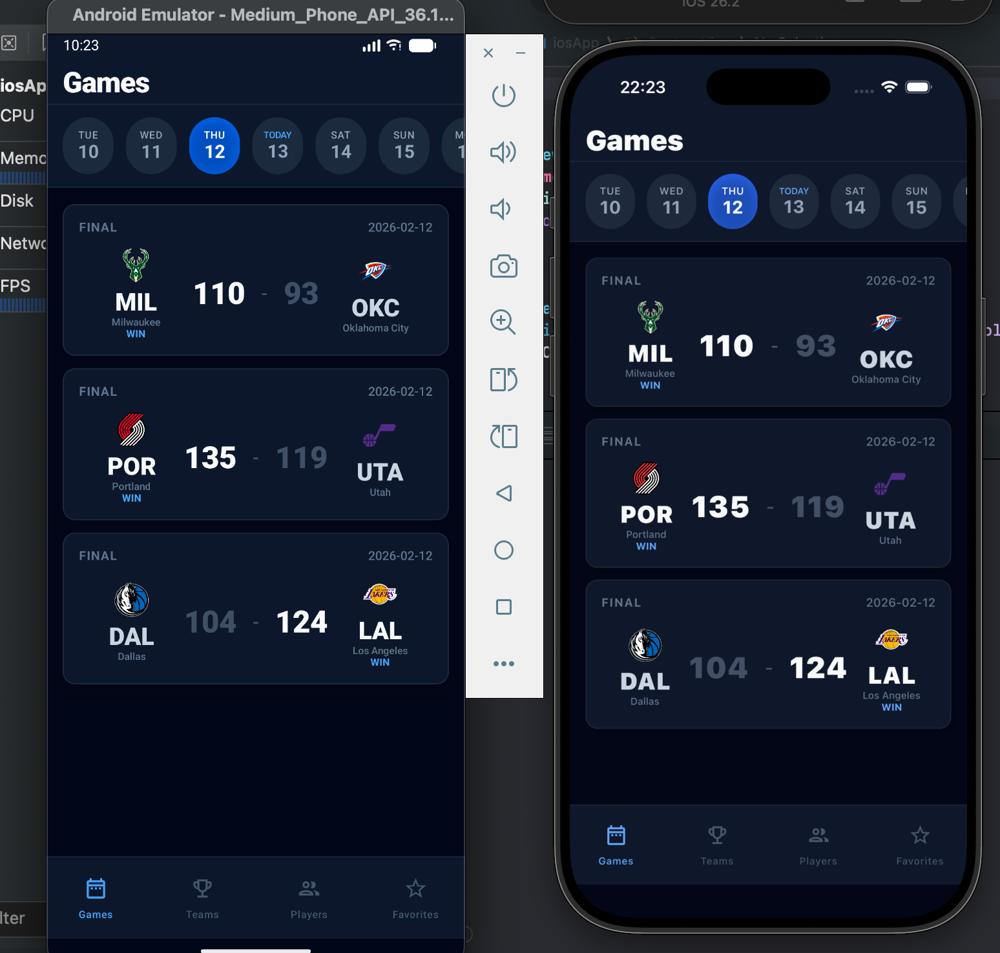
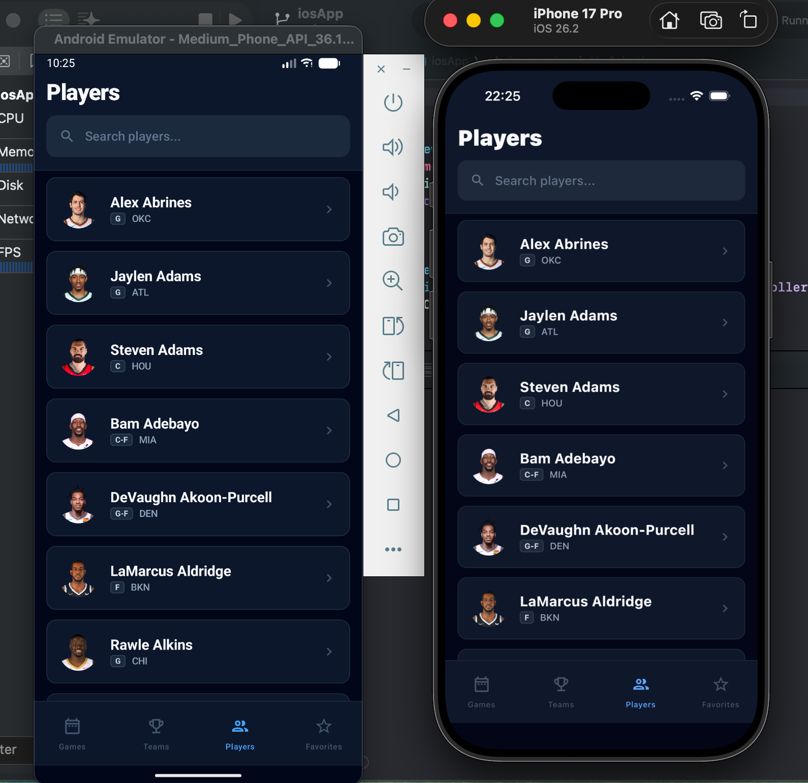
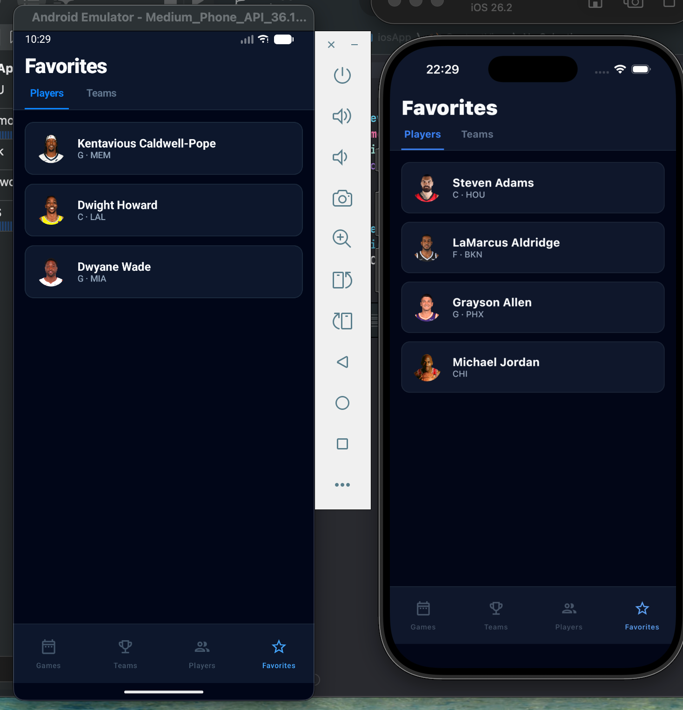
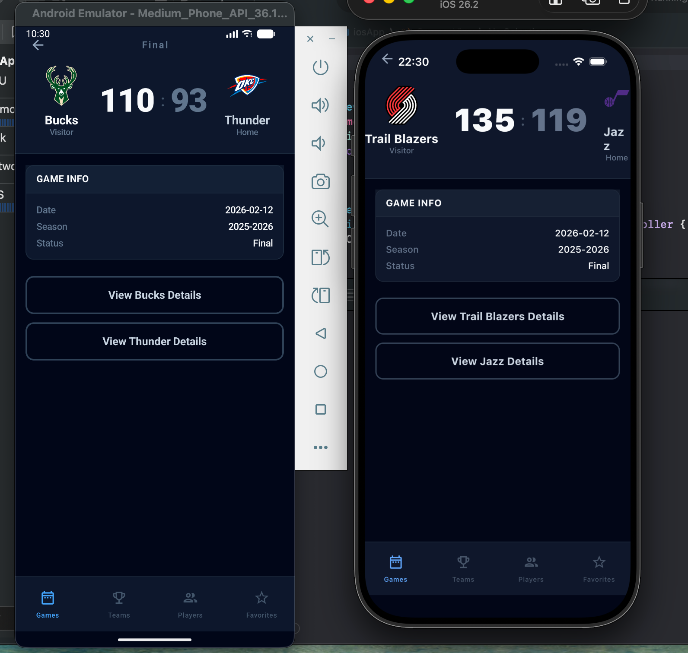
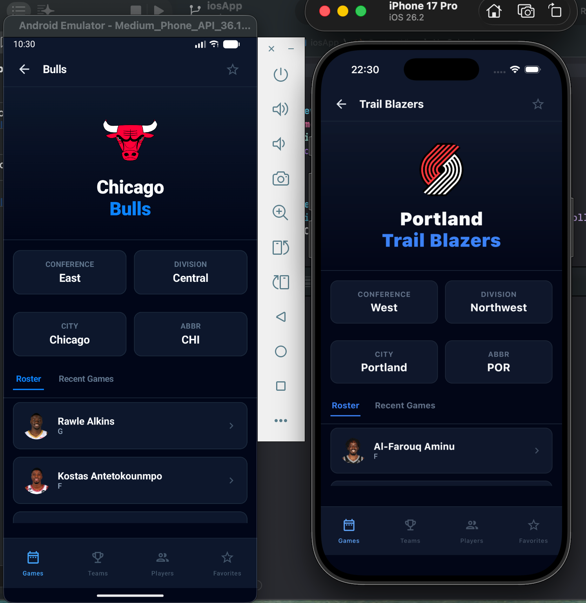
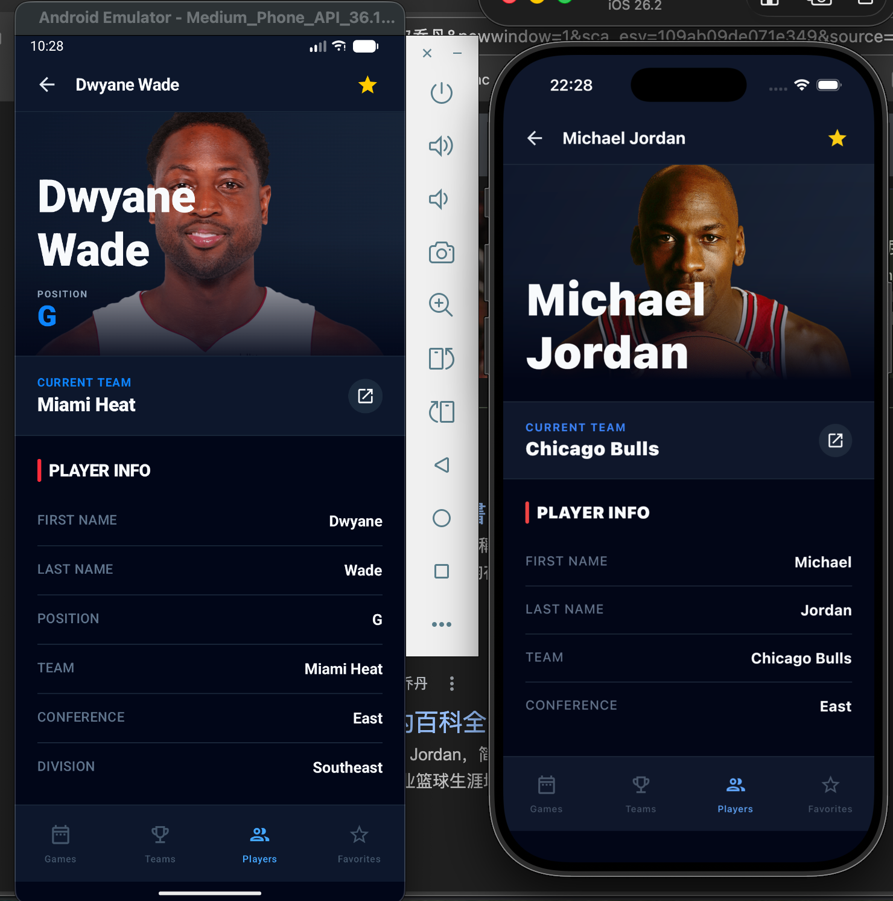

# HoopsNow - NBA 数据应用

[English](README.md) | 中文文档

**HoopsNow** 是一款使用 **Kotlin Multiplatform (KMP)** 和 **Compose Multiplatform (CMP)** 构建的跨平台 NBA 应用，Android 和 iOS 共享同一套代码。它提供实时比赛比分、球队信息、球员数据，并允许用户追踪他们喜爱的球队和球员。

> 本项目已从传统的 Android 多模块架构（Hilt + Navigation3 + Room）迁移至 KMP 共享模块架构。详见 [迁移指南](docs/ANDROID_TO_KMP_MIGRATION_GUIDE.md)。

## 功能特性

HoopsNow 展示来自 [Ball Don't Lie API](https://www.balldontlie.io/) 的内容，提供：

- **比赛**：查看今日 NBA 比赛的实时比分、最终结果和赛程安排
- **球队**：浏览全部 30 支 NBA 球队的详细信息
- **球员**：搜索和探索 NBA 球员的数据及所属球队
- **收藏**：保存喜爱的球队和球员以便快速访问

### 应用截图

<p align="center">
  
  
  
  
</p>

<p align="center">
  
  
  
</p>

## 架构设计

HoopsNow 采用 **KMP 共享模块** 架构 — 所有业务逻辑和 UI 代码都在 `shared` 模块中，Android 和 iOS 仅保留极简的平台入口。

### 项目结构

```
hoopsnow/
├── app/                                # Android 入口（极简）
│   └── src/main/java/.../
│       ├── MainActivity.kt             # 承载 HoopsNowApp()
│       └── HoopsNowApplication.kt      # 初始化 Koin
│
├── shared/                             # KMP 共享模块（全部逻辑 + UI）
│   └── src/
│       ├── commonMain/                 # 跨平台共享代码
│       │   ├── kotlin/.../
│       │   │   ├── core/
│       │   │   │   ├── common/         # Result 包装器、异常定义
│       │   │   │   ├── data/           # Repository 接口 + 实现
│       │   │   │   ├── database/       # DatabaseDriverFactory (expect)
│       │   │   │   ├── model/          # 领域模型 (Game, Team, Player)
│       │   │   │   └── network/        # Ktor 网络层
│       │   │   ├── di/                 # Koin 模块定义
│       │   │   └── ui/
│       │   │       ├── HoopsNowApp.kt  # 主入口 Composable
│       │   │       ├── component/      # 通用 UI 组件
│       │   │       ├── navigation/     # Voyager Tab 定义
│       │   │       ├── theme/          # 颜色、字体、主题
│       │   │       ├── games/          # 比赛 Screen + ScreenModel
│       │   │       ├── teams/          # 球队 Screen + ScreenModel
│       │   │       ├── players/        # 球员 Screen + ScreenModel
│       │   │       └── favorites/      # 收藏 Screen + ScreenModel
│       │   └── sqldelight/             # .sq 表结构和查询文件
│       ├── androidMain/                # Android: OkHttp 引擎、SQLite 驱动
│       └── iosMain/                    # iOS: Darwin 引擎、Native 驱动
│
├── iosApp/                             # iOS 入口（SwiftUI 壳）
│   └── iosApp/
│       ├── iosApp.xcodeproj/           # Xcode 工程文件
│       ├── iOSApp.swift                # 初始化 Koin
│       ├── ContentView.swift           # 嵌入 ComposeUIViewController
│       └── Info.plist                  # iOS 配置
│
├── build-logic/                        # Convention Plugins
└── gradle/libs.versions.toml           # 依赖版本管理
```

### 核心架构决策

- **单一共享模块**：所有业务逻辑和 UI 在一个 KMP 模块中，平台入口极简
- **单向数据流 (UDF)**：状态向下流动，事件向上流动
- **离线优先**：本地数据库作为数据源，与远程 API 同步
- **仓库模式**：接口/实现分离以提高可测试性
- **Voyager 导航**：`TabNavigator` 管理底部标签，每个 Tab 内嵌独立 `Navigator` 管理页面栈
- **ScreenModel**：Voyager 的生命周期感知状态持有者（替代 ViewModel）
- **Koin DI**：跨平台依赖注入，通过 `expect/actual` 提供平台模块
- **expect/actual**：数据库驱动和 HTTP 引擎的平台特定实现

### 数据层架构

```
┌─────────────────────────────────────────┐
│              UI 层                       │
│  (Compose Screens + ScreenModels)       │
├─────────────────────────────────────────┤
│            数据层                        │
│  (Repository 接口)                       │
├─────────────────────────────────────────┤
│         离线优先实现                      │
│  (SQLDelight 数据库 + Ktor 网络)         │
└─────────────────────────────────────────┘
```

## 技术栈

| 类别 | 技术 |
|------|------|
| 语言 | Kotlin 2.0.21 |
| UI | Compose Multiplatform 1.7.3, Material 3 |
| 导航 | Voyager 1.1.0-beta03 |
| 依赖注入 | Koin 4.0.0 |
| 数据库 | SQLDelight 2.0.2 |
| 网络 | Ktor 3.0.3, Kotlin Serialization 1.7.3 |
| 图片加载 | Coil 3.0.4 (KMP) |
| 异步 | Kotlin Coroutines 1.9.0, Flow |
| 日期时间 | kotlinx-datetime 0.6.1 |
| 架构 | UDF、离线优先、仓库模式 |
| 构建 | Gradle 8.11.1, AGP 8.9.1, Convention Plugins |
| 平台 | Android, iOS |

## 开发环境

### 环境要求

- Android Studio Ladybug (2024.2.1) 或更新版本
- JDK 17
- Android SDK 36
- Xcode 15.0+（iOS 开发需要）

### 快速开始

1. 克隆仓库：
```bash
git clone https://github.com/laibinzhi/hoopsnow.git
cd hoopsnow
git checkout cmp
```

2. 在 Android Studio 中打开项目

3. 同步 Gradle 并在模拟器或设备上运行应用

### 构建

构建 Android Debug APK：
```bash
./gradlew :app:assembleDebug
```

构建 Android Release APK：
```bash
./gradlew :app:assembleRelease
```

构建 iOS Framework（Apple Silicon 模拟器）：
```bash
./gradlew :shared:linkDebugFrameworkIosSimulatorArm64
```

### 运行 iOS 应用

1. 构建 shared framework（见上方命令）
2. 用 Xcode 打开 `iosApp/iosApp/iosApp.xcodeproj`
3. 选择模拟器，按 ⌘R 运行

详细 iOS 配置请参考 [iOS 接入指南](docs/IOS_INTEGRATION_GUIDE.md)。

## API

本应用使用 [Ball Don't Lie API](https://www.balldontlie.io/) 获取 NBA 数据。API 提供：

- 球队信息
- 带搜索功能的球员数据
- 比赛比分和赛程

## UI 设计

HoopsNow 实现了针对体育内容观看优化的深色主题：

- **配色方案**：基于 Slate 的深色主题，搭配蓝色强调色
- **字体排版**：粗体、体育风格的文字层次
- **组件**：自定义比赛卡片、球队/球员列表项
- **全面屏**：完整的沉浸式体验，正确处理系统边距

## 文档

- [Android 迁移 KMP 指南](docs/ANDROID_TO_KMP_MIGRATION_GUIDE.md) — 从多模块 Android 迁移到 KMP 的完整说明
- [iOS 接入指南](docs/IOS_INTEGRATION_GUIDE.md) — iOS 应用的构建、配置和运行指南

## 贡献

欢迎贡献！请随时提交 Pull Request。

1. Fork 本仓库
2. 创建功能分支（`git checkout -b feature/amazing-feature`）
3. 提交更改（`git commit -m 'Add some amazing feature'`）
4. 推送到分支（`git push origin feature/amazing-feature`）
5. 创建 Pull Request

## 许可证

```
Copyright 2026 HoopsNow

Licensed under the Apache License, Version 2.0 (the "License");
you may not use this file except in compliance with the License.
You may obtain a copy of the License at

    http://www.apache.org/licenses/LICENSE-2.0

Unless required by applicable law or agreed to in writing, software
distributed under the License is distributed on an "AS IS" BASIS,
WITHOUT WARRANTIES OR CONDITIONS OF ANY KIND, either express or implied.
See the License for the specific language governing permissions and
limitations under the License.
```

## 致谢

- [Kotlin Multiplatform](https://kotlinlang.org/docs/multiplatform.html) - 跨平台框架
- [Compose Multiplatform](https://www.jetbrains.com/lp/compose-multiplatform/) - 共享 UI 工具包
- [Voyager](https://voyager.adriel.cafe/) - 跨平台导航框架
- [Koin](https://insert-koin.io/) - 依赖注入框架
- [SQLDelight](https://cashapp.github.io/sqldelight/) - 跨平台数据库
- [Ball Don't Lie API](https://www.balldontlie.io/) - NBA 数据提供商
