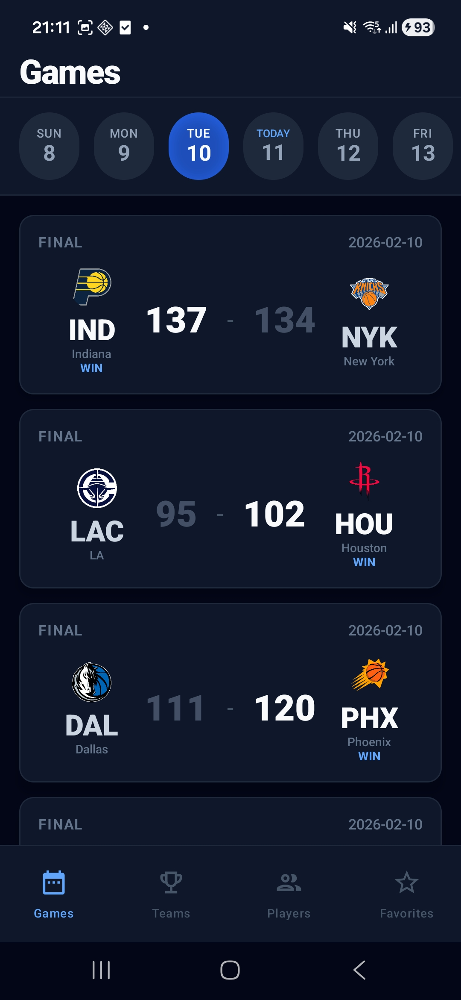
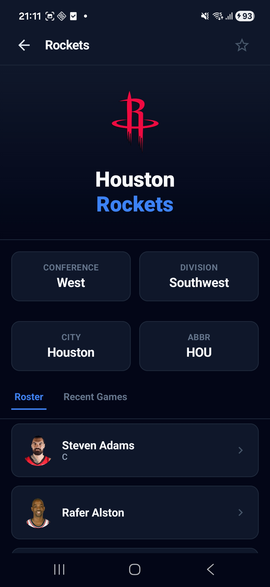
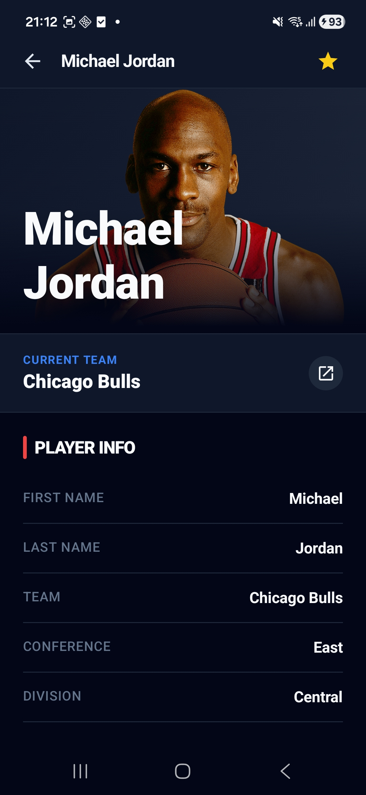

# HoopsNow - NBA 数据应用

[English](README.md) | 中文文档

**HoopsNow** 是一款专为 NBA 球迷打造的现代 Android 应用，完全使用 **Kotlin** 和 **Jetpack Compose** 构建。它提供实时比赛比分、球队信息、球员数据，并允许用户追踪他们喜爱的球队和球员。

本应用遵循 Android 官方推荐的[架构指南](https://developer.android.com/topic/architecture)，可作为构建生产级 Android 应用的参考实现。

## 分支说明

本仓库当前维护两个长期分支：

- `main`（当前分支）：Android 单平台实现，采用多模块架构（`Hilt + Navigation 3 + Room`）
- `cmp`：基于 Kotlin Multiplatform + Compose Multiplatform 的跨平台实现，共享 Android/iOS 代码（`Koin + Voyager + SQLDelight`）

切换到 CMP 分支：

```bash
git checkout cmp
```

如果你想对比两套实现，建议先阅读 `main`，再切换到 `cmp`。

## 功能特性

HoopsNow 展示来自 [Ball Don't Lie API](https://www.balldontlie.io/) 的内容，提供：

- **比赛**：查看今日 NBA 比赛的实时比分、最终结果和赛程安排
- **球队**：浏览全部 30 支 NBA 球队的详细信息
- **球员**：搜索和探索 NBA 球员的数据及所属球队
- **收藏**：保存喜爱的球队和球员以便快速访问

### 应用截图

<p align="center">
  
  
  
  
</p>

<p align="center">
  
  
  
</p>

## 架构设计

HoopsNow 遵循 [Now in Android](https://github.com/android/nowinandroid) 架构模式，采用模块化结构，将公共 API 契约与内部实现分离。

### 模块结构

```
app/                        # 应用模块 - 导航、脚手架
├── navigation/             # Navigation 3 实现

build-logic/                # Convention Plugins 统一构建配置
└── convention/             # Gradle 约定插件

feature/                    # 功能模块 (api/impl 模式)
├── games/
│   ├── api/                # 公共导航契约 (NavKeys)
│   └── impl/               # 内部实现 (Screens, ViewModels)
├── teams/
│   ├── api/
│   └── impl/
├── players/
│   ├── api/
│   └── impl/
└── favorites/
    ├── api/
    └── impl/

core/                       # 核心模块
├── common/                 # 共享工具、调度器、Result 包装器
├── data/                   # 仓库层 (接口 + 离线优先实现)
├── database/               # Room 数据库、DAO、实体
├── datastore/              # DataStore 用户偏好存储
├── network/                # Retrofit API 实现
├── model/                  # 领域模型 (纯 Kotlin)
├── designsystem/           # 主题、颜色、可复用组件
├── ui/                     # 跨功能共享 UI 组件
└── testing/                # 测试工具、Fake 实现、测试数据
```

### 功能模块模式

每个功能模块分为两个子模块：

- **api**：包含公共导航契约（`NavKey` 定义），其他模块可以依赖
- **impl**：包含内部实现（Screens、ViewModels、UiState），不对外暴露

这种模式提供：
- 清晰的模块边界和依赖关系
- 通过更好的并行化加快构建速度
- 实现细节的封装

### 核心架构决策

- **单向数据流 (UDF)**：状态向下流动，事件向上流动
- **离线优先**：本地数据库作为数据源，与远程同步
- **仓库模式**：接口/实现分离以提高可测试性
- **StateFlow**：ViewModel 中的响应式状态管理
- **密封接口**：类型安全的 UI 状态（Loading、Success、Empty、Error）
- **Navigation 3**：使用可序列化 NavKeys 的类型安全导航
- **Convention Plugins**：跨模块的统一构建配置
- **类型安全项目访问器**：类型安全的模块依赖（`projects.core.data`）

### 数据层架构

```
┌─────────────────────────────────────────┐
│              UI 层                       │
│  (Compose Screens + ViewModels)          │
├─────────────────────────────────────────┤
│            数据层                        │
│  (Repository 接口)                       │
├─────────────────────────────────────────┤
│         离线优先实现                      │
│  (Room 数据库 + 网络同步)                 │
└─────────────────────────────────────────┘
```

## 技术栈

| 类别 | 技术 |
|------|------|
| 语言 | Kotlin |
| UI | Jetpack Compose, Material 3 |
| 导航 | Navigation 3 |
| 依赖注入 | Hilt |
| 数据库 | Room |
| 偏好存储 | DataStore |
| 网络 | Retrofit, OkHttp, Kotlin Serialization |
| 异步 | Kotlin Coroutines, Flow |
| 架构 | MVVM, NIA (Now in Android) 模式 |
| 构建 | Gradle 8.11.1, AGP 8.9.1, Convention Plugins |
| 测试 | JUnit, Turbine, Coroutines Test |

## 开发环境

### 环境要求

- Android Studio Ladybug (2024.2.1) 或更新版本
- JDK 17
- Android SDK 36

### 快速开始

1. 克隆仓库：
```bash
git clone https://github.com/laibinzhi/hoopsnow.git
cd hoopsnow
```

2. 在 Android Studio 中打开项目

3. 同步 Gradle 并在模拟器或设备上运行应用

### 构建

构建 Debug APK：
```bash
./gradlew :app:assembleDebug
```

构建 Release APK：
```bash
./gradlew :app:assembleRelease
```

### 测试

运行单元测试：
```bash
./gradlew test
```

`core:testing` 模块提供：
- **Fake 仓库**：`FakeFavoritesRepository`、`FakePlayersRepository`、`FakeTeamsRepository`、`FakeGamesRepository`
- **测试工具**：用于协程测试的 `MainDispatcherRule`
- **测试数据**：用于创建测试对象的 `TestData` 工厂

## API

本应用使用 [Ball Don't Lie API](https://www.balldontlie.io/) 获取 NBA 数据。API 提供：

- 球队信息
- 带搜索功能的球员数据
- 比赛比分和赛程

## UI 设计

HoopsNow 实现了针对体育内容观看优化的深色主题：

- **配色方案**：基于 Slate 的深色主题，搭配蓝色强调色
- **字体排版**：粗体、体育风格的文字层次
- **组件**：自定义比赛卡片、球队/球员列表项
- **全面屏**：完整的沉浸式体验，正确处理系统边距

## 贡献

欢迎贡献！请随时提交 Pull Request。

1. Fork 本仓库
2. 创建功能分支（`git checkout -b feature/amazing-feature`）
3. 提交更改（`git commit -m 'Add some amazing feature'`）
4. 推送到分支（`git push origin feature/amazing-feature`）
5. 创建 Pull Request

## 许可证

```
Copyright 2026 HoopsNow

Licensed under the Apache License, Version 2.0 (the "License");
you may not use this file except in compliance with the License.
You may obtain a copy of the License at

    http://www.apache.org/licenses/LICENSE-2.0

Unless required by applicable law or agreed to in writing, software
distributed under the License is distributed on an "AS IS" BASIS,
WITHOUT WARRANTIES OR CONDITIONS OF ANY KIND, either express or implied.
See the License for the specific language governing permissions and
limitations under the License.
```

## 致谢

- [Now in Android](https://github.com/android/nowinandroid) - 架构参考
- [Ball Don't Lie API](https://www.balldontlie.io/) - NBA 数据提供商
- [Jetpack Compose](https://developer.android.com/jetpack/compose) - 现代 Android UI 工具包
